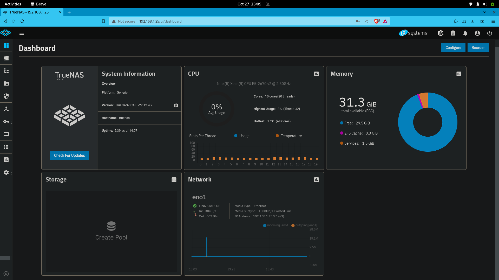

# BIGHOMESERV 🖥

Homeserv's big brother. Aimed at helping you to set up your infrastructure very easily.

Most of this tutorial comes from the official website : https://www.truenas.com/docs/scale/22.12/scaletutorials/toptoolbar/

## Table of Contents
1. [Installation of TrueNAS Scale](#installation)
2. [Disk Management and RAID Configuration](#disk-management)
   1. [Disk Management](#disk-management)
   2. [RAID Configuration](#raid-configuration)
3. [Setting up a VPN with a Domain Name](#vpn-setup)
   1. [Domain Name Registration (e.g., using Infomaniak)](#domain-registration)
   2. [VPN Configuration](#vpn-configuration)
4. [DNS Configuration](#dns-configuration)
5. [User Management](#user-management)
6. [Installation and Setup of GitLab](#gitlab-setup)
7. [Conclusion](#conclusion)

## Installation of TrueNAS Scale 

This tutorial describes the web interface configuration

### Dashboard

## Disk Management and RAID Configuration 

TrueNAS uses ZFS filesystem, so even if the concepts are still similar to RAID, it bears the name of RAID-Z.

### Disk Management 

### RAID-Z Configuration 

* RAID-Z1 (Single Parity, similar to RAID 5):

    * One drive is used for parity, and the rest are for data.
    * Can tolerate the failure of a single drive.

* RAID-Z2 (Double Parity, similar to RAID 6):

    * Two drives are used for parity, and the rest are for data.
    * Can tolerate the failure of two drives.

* RAID-Z3 (Triple Parity):

    * Three drives are used for parity, and the rest are for data.
    * Can tolerate the failure of three drives.

* Mirror Vdev (Similar to RAID 1):

    * Pairs of drives are used in a mirror configuration.
    * Provides excellent redundancy but reduces the usable space.

* Striped Vdev (Similar to RAID 0):

    * Drives are combined into a single striped set. 
    * Provides increased storage capacity and performance but no redundancy.

* Mixed Vdevs (Combination of the above):

    * You can mix and match different types of vdevs in a pool to achieve your desired balance of performance and redundancy.

### RAID-Z Configuration 

My personal configuration is 4 HDDs of 1Tb each.

I will use RAID-Z1 to have a good balance between redundancy and speed :

* 4 x 1Tb HDDs should give me about 3Tb of storage.
* Up to one disk can fail at a time.

## Setting up a VPN with a Domain Name 

### Domain Name Registration (e.g., using Infomaniak) 

### VPN Configuration 

## DNS Configuration 

## User Management 

## Installation and Setup of GitLab 

## Conclusion 

