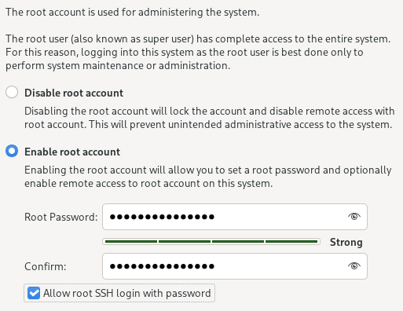
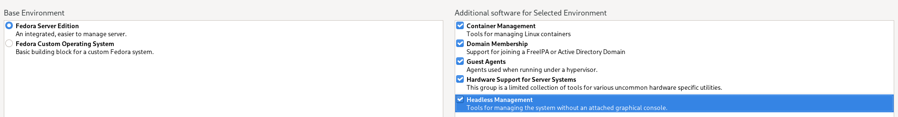
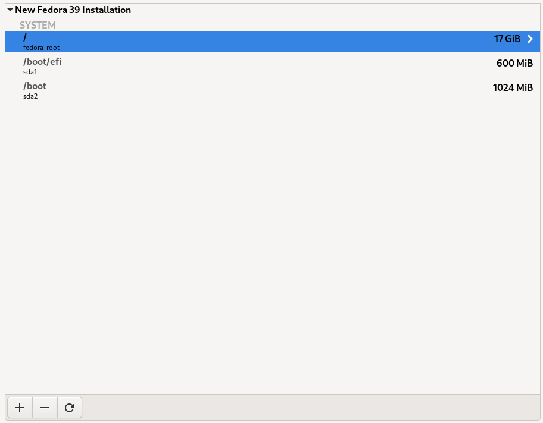

# BIGHOMESERV 🖥

TrueNAS scale tutorial for beginners.

Homeserv's big brother. Aimed at helping you to set up your infrastructure very easily.

Most of this tutorial comes from the official website : https://www.truenas.com/docs/scale/22.12/scaletutorials/toptoolbar/

For information, I use Fedora Linux 38 (Workstation Edition).

## Table of Contents

1. [Considerations](#considerations)
1. [Installation of TrueNAS Scale](#installation)
2. [Disk Management and RAID Configuration](#disk-management)
   1. [Disk Management](#disk-management)
   2. [RAID Configuration](#raid-configuration)
3. [Setting up a VPN](#vpn-setup)
   1. [Domain Name Registration (e.g., using Infomaniak)](#domain-registration)
   2. [VPN Configuration](#vpn-configuration)
4. [DNS Configuration](#dns-configuration)
5. [User Management](#user-management)
6. [Installation and Setup of GitLab](#gitlab-setup)
7. [Conclusion](#conclusion)
8. [Sources](#)

## Setting up a VPN

### WebSocket Tunneled VPN using Fedora Linux

By the time I got my first server up and running, I started computing school, and the school firewall blocks wireguard (here, wg-easy).

The method used by Nerd on the Street is using tls tunnelling to hide the vpn.

Here are the steps I had to do to set it up :

#### Install Fedora 

Install Fedora Server in a VM on your Truenas machine.

I use a root account for simplicity :
<details>
<summary> Image </summary>

   
</details>


For the installed packages :
<details>
<summary> Image </summary>


</details>


For the storage, auto config and resize the / partition a bit bigger, ie. 17GB :
<details>
<summary> Image </summary>


</details>


I enable the root account over cockpit by going in 

```
sudo dnf install nano -y
nano /etc/cockpit/disallowed-users
```

and commenting the line written "root".

Then connect through cockpit to your server.

#### Wireguard install

First, install wireguard

```
dnf install wireguard-tools -y
```

#### Enable IPv4 forwarding

```
nano /etc/sysctl.d/99-custom.conf
```

Add the following line

```
net.ipv4.ip_forward=1
```
After saving, apply the configuration with :

```
sysctl -p /etc/sysctl.d/99-custom.conf
```

It should look like this :

```
[root@localhost cockpit]# nano /etc/sysctl.d/99-custom.conf
[root@localhost cockpit]# sysctl -p /etc/sysctl.d/99-custom.conf 
net.ipv4.ip_forward = 1
[root@localhost cockpit]#
```

#### Reboot

```
reboot
```

🗈 Note : You might need to restart the server violently through truenas to access cockpit. At least it happened to me.

#### Generate the keys

```
wg genkey | tee /etc/wireguard/privatekey | wg pubkey | tee /etc/wireguard/publickey
```

The output should look like 

```
7aBRBnT32R+8f04Ug9IruGWzGSaN9+g0riprzaT4HS0=
```

#### Pimp the configuration file 

```
nano /etc/wireguard/wg0.conf
```

Add this configuration in the config file, with your PrivateKey :

```
[Interface]
Address = 10.0.0.1/24
SaveConfig = true
ListenPort = 51820
PrivateKey = <replace-with-your-generated-private-key>
PostUp     = firewall-cmd --zone=public --add-port 51820/udp && firewall-cmd --zone=public --add-masquerade
PostDown   = firewall-cmd --zone=public --remove-port 51820/udp && firewall-cmd --zone=public --remove-masquerade
```

#### Start firewalld

```
systemctl start firewalld
```

#### Enable WireGuard interface

```
wg-quick up wg0
```

The output should look like :

```
[#] ip link add wg0 type wireguard
[#] wg setconf wg0 /dev/fd/63
[#] ip -4 address add 10.0.0.1/24 dev wg0
[#] ip link set mtu 1420 up dev wg0
[#] firewall-cmd --zone=public --add-port 51820/udp && firewall-cmd --zone=public --add-masquerade
success
success
```

#### Enable WireGuard at boot

```
systemctl enable wg-quick@wg0
```

## Sources : 

https://nerdonthestreet.com/wiki?find=Set+Up+a+WireGuard+VPN+Server+with+WebSocket+Tunneling

https://www.atlantic.net/dedicated-server-hosting/how-to-install-and-configure-wireguard-vpn-server-on-fedora/

