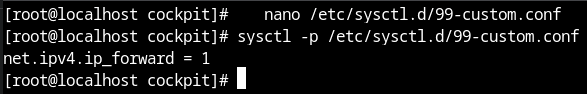

# BIGHOMESERV 🖥

TrueNAS scale tutorial for beginners.

Homeserv's big brother. Aimed at helping you to set up your infrastructure very easily.

Most of this tutorial comes from the official website : https://www.truenas.com/docs/scale/22.12/scaletutorials/toptoolbar/

For information, I use Fedora Linux 38 (Workstation Edition).

## Table of Contents

1. [Considerations](#considerations)
1. [Installation of TrueNAS Scale](#installation)
2. [Disk Management and RAID Configuration](#disk-management)
   1. [Disk Management](#disk-management)
   2. [RAID Configuration](#raid-configuration)
3. [Setting up a VPN with a Domain Name](#vpn-setup)
   1. [Domain Name Registration (e.g., using Infomaniak)](#domain-registration)
   2. [VPN Configuration](#vpn-configuration)
4. [DNS Configuration](#dns-configuration)
5. [User Management](#user-management)
6. [Installation and Setup of GitLab](#gitlab-setup)
7. [Conclusion](#conclusion)
8. [Sources](#)


By the time I got my first server up and running, I started computing school, and the school firewall blocks wireguard (here, wg-easy).

The method used by Nerd on the Street is using tls tunnelling to hide the vpn.

Here are the steps I had to do to set it up :

1) Install Fedora 

Install Fedora Server in a VM on your Truenas machine.

I enable the root account over cockpit by going in 

```
nano /etc/cockpit/disallowed-users
```

and commenting the line written "root".

Then connect through cockpit to your server.

2) Wireguard install

   First, install wireguard

   ```
   dnf install wireguard-tools -y
   ```

3) Enable IPv4 forwarding

   ```
   nano /etc/sysctl.d/99-custom.conf
   ```

   Add the following line

   ```
   net.ipv4.ip_forward=1
   ```
   After saving, apply the configuration with :

   ```
   sysctl -p /etc/sysctl.d/99-custom.conf
   ```

   It should look like this :

   


4) Reboot

Sources :

https://nerdonthestreet.com/wiki?find=Set+Up+a+WireGuard+VPN+Server+with+WebSocket+Tunneling

https://www.atlantic.net/dedicated-server-hosting/how-to-install-and-configure-wireguard-vpn-server-on-fedora/

