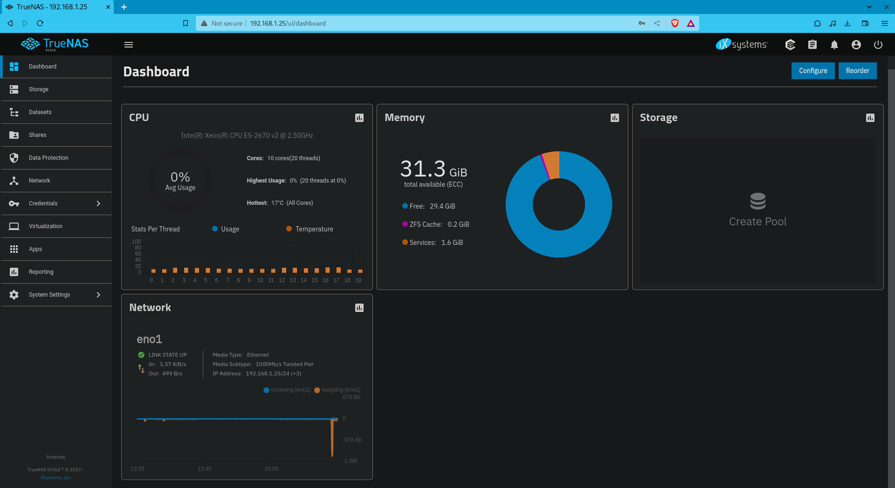

# BIGHOMESERV 🖥

TrueNAS scale tutorial for beginners.

Homeserv's big brother. Aimed at helping you to set up your infrastructure very easily.

Most of this tutorial comes from the official website : https://www.truenas.com/docs/scale/22.12/scaletutorials/toptoolbar/

For information, I use Fedora Linux 38 (Workstation Edition).

## Table of Contents
1. [Considerations](#considerations)
1. [Installation of TrueNAS Scale](#installation)
2. [Disk Management and RAID Configuration](#disk-management)
   1. [Disk Management](#disk-management)
   2. [RAID Configuration](#raid-configuration)
3. [Setting up a VPN with a Domain Name](#vpn-setup)
   1. [Domain Name Registration (e.g., using Infomaniak)](#domain-registration)
   2. [VPN Configuration](#vpn-configuration)
4. [DNS Configuration](#dns-configuration)
5. [User Management](#user-management)
6. [Installation and Setup of GitLab](#gitlab-setup)
7. [Conclusion](#conclusion)

## Pre-installation considerations <a name="considerations"></a>

From a persona experience with a DELL POWEREDGE R720.

* First of all, do not modify anything about the iDRAC if it is not needed, my iDRAC got broken because of an update
* My R720 comes with a raid controller, so, I had to create virtual disks using RAID 0 on every disk that is installed, or they weren't displayed. It is dumb, but it works like this.

⚠️ Do not set up any RAID config, TrueNAS uses ZFS and hence RAID-Z (and it is automatic) ⚠️

## Installation of TrueNAS Scale <a name="installation"></a>

### Bootable media

### GUI ntallation

It is more convenient to use the web UI to configure the server, so the web configuration is selected :

### Initial login


### Dashboard

Once you are logged in, you can see the dashboard. Wdgets can be reorganized by clicking on ```Reoarder``` or ```Configure``` in the top right corner.



After shutting down or during a reboot, the webUI looks like this :


## Disk Management and RAID Configuration <a name="disk-management"></a>

TrueNAS uses ZFS filesystem, so even if the concepts are still similar to RAID, it bears the name of RAID-Z.

### Disk Management <a name="disk-management"></a>


### RAID-Z Configuration <a name="raid-z"></a>

* RAID-Z1 (Single Parity, similar to RAID 5):

    * One drive is used for parity, and the rest are for data.
    * Can tolerate the failure of a single drive.

* RAID-Z2 (Double Parity, similar to RAID 6):

    * Two drives are used for parity, and the rest are for data.
    * Can tolerate the failure of two drives.

* RAID-Z3 (Triple Parity):

    * Three drives are used for parity, and the rest are for data.
    * Can tolerate the failure of three drives.

* Mirror Vdev (Similar to RAID 1):

    * Pairs of drives are used in a mirror configuration.
    * Provides excellent redundancy but reduces the usable space.

* Striped Vdev (Similar to RAID 0):

    * Drives are combined into a single striped set. 
    * Provides increased storage capacity and performance but no redundancy.

* Mixed Vdevs (Combination of the above):

    * You can mix and match different types of vdevs in a pool to achieve your desired balance of performance and redundancy.

### RAID-Z Configuration <a name="raid-configuration"></a>

My personal configuration is 4 HDDs of 1Tb each.

I will use RAID-Z1 to have a good balance between redundancy and speed :

* 4 x 1Tb HDDs should give me about 3Tb of storage.
* Up to one disk can fail at a time.


## Setting up a VPN with a Domain Name <a name="vpn-setup"></a>

### Domain Name Registration (e.g., using Infomaniak) <a name="domain-registration"></a>

### VPN Configuration <a name="vpn-configuration"></a>

## DNS Configuration <a name="dns-configuration"></a>

## User Management <a name="user-management"></a>

## Installation and Setup of GitLab <a name="gitlab-setup"></a>

## Conclusion <a name="conclusion"></a>


## Notes

1) a faire absolument wireguard et HAPROXY(virtualié car docker est dur à setup)

Namecheap

Faire des dmz (zones demilitarisées aka vlan ou le trafic ne peut que sortir)


1) Haproxy ou Nginx
    * Reverse proxy
        Peut anonymiser un réseau
    * Load balancing    
        Ce domaine là va à cette machine

2) Regles de firewall 

PFSENSE


